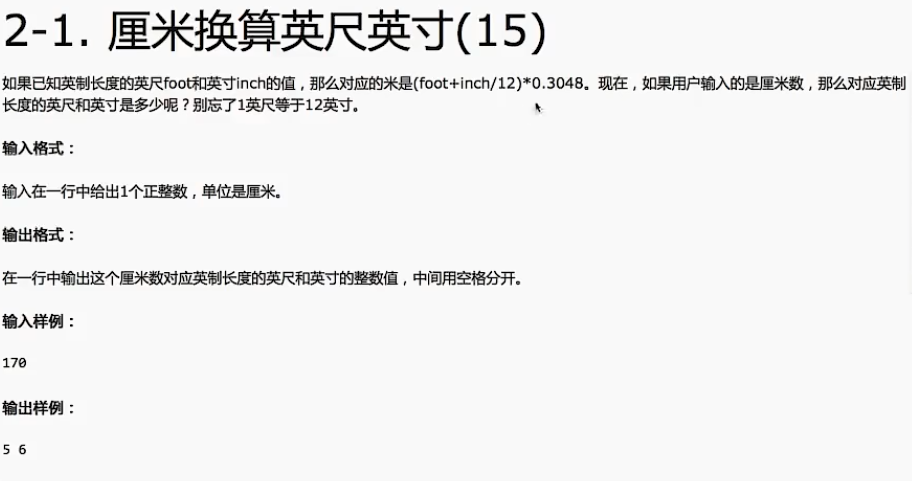
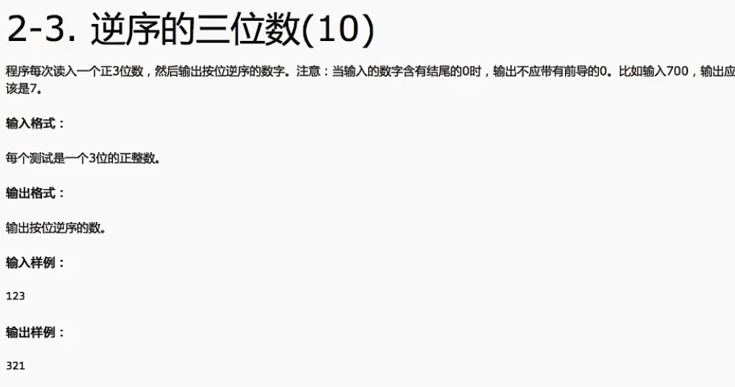
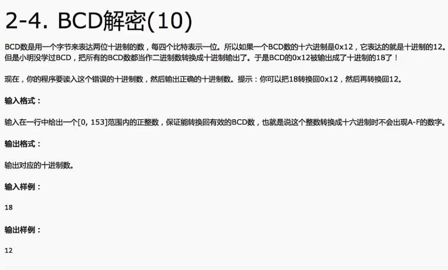
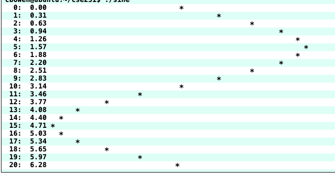
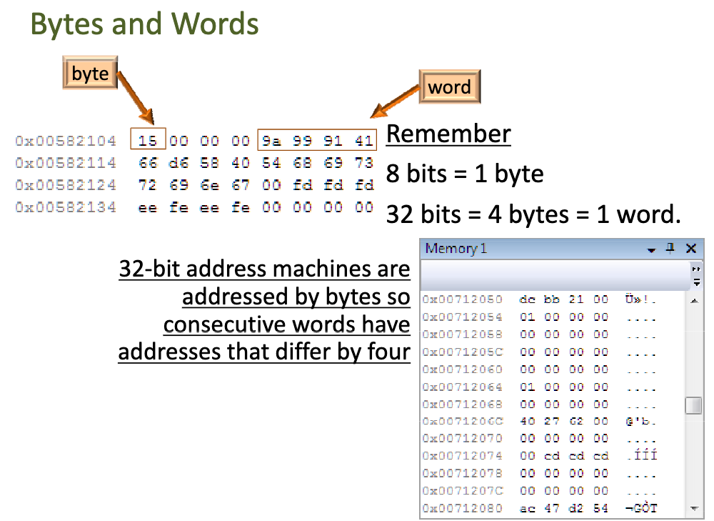
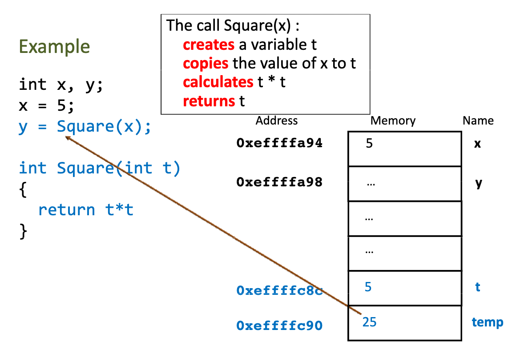

# C语言基础

为了夯实 CS 基本功，于网上找到一份硬核[学习计划](https://www.yuque.com/ob26eq/cv94p5/xi9hwb)，首先学习的是 [C 语言先导课程](https://www.cse.msu.edu/~cse251/index.html)。

**程序**是用特殊的编程语言用来表达如何解决问题的。不是用编程与计算机交谈，而是描述要求其如何做事情的过程和方法。

**程序的执行**

- 解释：借助一个程序，那个程序能理解你的程序，然后按照你的要求执行。
- 编译：借助一个程序，就像一个翻译，把你的程序翻译成计算机真正能懂的语言-机器语言-写的程序，然后这个机器语言写的程序就能执行了

**解释语言 VS 编译语言**

- 语言本无编译/解释之分
- 常用的执行方式而已
- 解释型语言有特殊的计算能力
- 编译型语言有特定的运算性能

## 前置知识（Unix 命令）

```bash
pwd	Displays the current directory
ls	List the current directory	ls
ls -l
ls -a
-l : Include file details, -a : Include hidden files, -F : show directories
touch MyFirstFile setting the time and date of the file to the current time and date, if the file does not exist,it creates an empty one.
rm	Remove a file	rm filetonuke.c rm -i file.c interactive delete file
mkdir	Create a new directory	mkdir cse251
rmdir	Remove a directory	rmdir cse251
Or rm -r if the directory is not empty.
cd	Change current directory	cd ~/cse251
cp	Copy a file	cp souce destination cp ile.c newFile.c  cp ../file.c ~/programs
mv	Move or rename a file	mv hello.c newname.c mv hello.c ../path/
cat	Display the contents of a file	cat hello.c
less	Display file contents nicely	less hello.c
man	Manual pages	man ls
yelp	Nicer help display	yelp &
top	Displays CPU usage	top
q to quit
top display of what processes are using how much CPU and puts the heavies user first
ps	Lists processes	ps u
kill	Kills a process	kill 15577
~: a shortcut for your home directory
gcc hello.c use GNU C Compiler to compile program,and the default output file is a.out
./a.out execute file in the current directory
gcc -o hello hello.c -o indicate the output file is hello instead of a.out
```

## C 语言介绍

在 C 语言头部表明引用的库，如常见的 `<stdio.h>` 表明引入的是标准的输入输出库。

```c
#include <stdio.h>
/*
	上面是必要的格式
	.h 表示头文件，因为这些文件是放在文件的头部
	#include 告诉预处理器将指定的头文件内容插入到预处理器命令的相应位置，导入头文件的预编译指令
	<> 表示系统自带的库
	如果写成 “” 则表明是用户自定义的库，如果没有找到则会去系统自带的库寻找，如果还找不到则报错
*/

/*
 * comment: this is my first program
 */
// main 函数是 C 语言执行的入口 有且只有一个
int main() {
	printf("hello world\n");
  return 0;
}
```


### Escape Characters

- `\n` new line
- `\t` tab
- `\'` print a single quote
- `\\` print a backslash
- many others

### Variable Declarations

- When declare a variable, must tell the compiler what kind of value the variable may hold(its type)
- You cannot change the type of the value a variable can hold once declared
- Everything needs a type in C and it must be declare before use

Syntax: <variable_type> <variable_name> [=<initial_value>]
example: `double width = 10;` `int height;`

```c
#include <stdio.h>
#include <limits.h>

int main() {
  printf("int 储存大小：%lu\n", sizeof(int));
}
```

`printf` 函数输出相关参数，详见[文档](https://www.runoob.com/cprogramming/c-function-printf.html)

```c
#include <stdio.h>
int main() {
  char ch = 'A';
  char str[13] = "www.baidu.com"; 
  float flt = 10.234;
  int no = 143;
  double dbl = 20.123456;
  printf("单个字符串 %c\n", ch);
  printf("字符串 %s\n", str);
  printf("浮点数 %f\n", flt);
  printf("整数 %d\n", no);
  printf("双精度 %lf\n", dbl);
  printf("八进制 %o\n", no);
  return 0;
}
```


```c
#include <stdio.h>
#include <math.h>
int main() {
  printf("%f\n", M_PI); //3.141593
  printf("%.4f\n", M_PI); //3.1416
  printf("%10.2f\n", M_PI); //      3.14
  printf("%-10.2f is PI\n", M_PI); //3.14       is PI
  return 0;
}
```

`%p` 输出变量地址

```c
#include <stdio.h>

int main() {
  float value = 0;
  printf("the value is %p\n", (void*)&value);
  return 0;
}
```

常量定义使用 const 如定义 100，`const int AMOUNT = 100;`，const 表明这个变量值无法修改

`a=b=6;` => `a=(b=6);`

**`%x` 输出的是无符号 16 进制**

## 输入输出练习题



```c
#include<stdio.h>

int main()
{
  int h = 0;
  printf("请输入身高多少厘米，如167：");
  scanf("%d", &h);
  double temp = h / 0.3048 / 100;
  int foot = temp;
  int inch = (temp - foot) * 12;
  printf("%d %d\n", foot, inch);
  return 0;
}
```


```c
#include <stdio.h>

int main() {
  int startTime = 0;
  int mins = 0;
  printf("please enter two integers: \n");
  scanf("%d %d", &startTime, &mins);
  int h = startTime / 100;
  int min = startTime % 100;
  int totalMins = h * 60 + min + mins;
  int endH = totalMins / 60;
  int endMin = totalMins % 60;
  int endTime = endH * 100 + endMin;
  printf("The end time is %d\n", endTime);
  return 0;
}
```



```c
#include <stdio.h>

int main() {
  int input = 0;
  printf("请输入一个正3位数: \n");
  scanf("%d", &input);
  int output = 0;
  while (input > 0)
  {
    int num = input % 10;
    output = output * 10 + num;
    input = input / 10;
  }
  printf("逆为序数为 %d\n", output);
  return 0;
}
```



```c
#include <stdio.h>

int main() {
  int input = 0;
  printf("请输入一个16进制的数字: \n");
  scanf("%d", &input);
  int output = (input / 16) * 10 + input % 16;
  printf("输出的数为 %d\n", output);
  printf("输出的数为 %x\n", input); // 使用16进制输出
  return 0;
}
```

## 流程控制和布尔值

在 C 语言中没有和 JavaScript 类似的 true 和 false 布尔值，这里使用 0 代表 false，非 0 代表 true。我们也可以引入对应的库来使用 true 和 false, 但是本质还是 1 和 0。

```c
#include <stdio.h>
#include <stdbool.h>

int main() {
  const bool TRUE = true;
  bool falseValue = false;
  int int3 = 3;
  int int8 = 8;
  printf("No 'boolean' output type\n");
  printf("bool trueValue: %d\n", TRUE);
  printf("bool falseValue: %d\n", falseValue);
  printf("int int3: %d\n", int3);
  printf("int int8: %d\n", int8);
  return 0;
}

/**
  No 'boolean' output type
  bool trueValue: 1
  bool falseValue: 0
  int int3: 3
  int int8: 8
*/
```

if 语句与其他语言类似。有时候我们需要种植程序如果输入了一个无效的数据，这时候我们可以使用 **exit** 函数，`exit(0)` 表示程序终止成功，`exit(1)` 表示程序退出时出现错误。

```c
#include <stdio.h>
#include <stdlib.h>
int main() {
  int num = 0;
  printf("please enter a number: ");
  scanf("%d", &num);
  if (num < 0) {
    printf("You moron, you entered a negative inductance!\n");
    exit(1);
  }
  else if (num == 0)
  {
    printf("You are really dumb, you entered zero.\n");
  }
  else
  {
    printf("Okay, I guess that's reasonable\n");
    exit(0);
  }
  printf("Output this line when num equals zero\n");
  return 0;
}
```

##  流程控制练习题

Read the instructions carefully before writing your code. Try to figure out what variables, if, and switch statements you need to create. Write a small part at a time and get it working.

i. Create a new file called tax.c. This program will compute the amount of tax owed by a taxpayer based on annual income and amount of tax exemptions.

ii. Prompt the user to enter his/her annual income.

<span style="color: red">If you get a segmentation fault, it is probably because you did not put the & on the variable in your scanf statement: scanf("%lf", &annualIncome);</span>

iii. If the annual income is less than $9350, the amount of tax owed is zero. Output zero and exit the program. You should get this part working before proceeding.

<span style="color: blue">Incremental Development means you write as little code at a time as you can and test it and get it working. Often it is useful to add in printf statements just to ensure a value is what you are expecting, then remove the statement when you are done.</span>

If you see this error:

```
tax.c:13: warning: incompatible implicit declaration of built-in function 'exit'
```

You forgot to #include <stdlib.h>

iv. Prompt the user to specify filing status, either as: (1) single, (2) married, filing jointly, or (3) married, filing separately

If the user chooses option (1) or option (3), set the number of dependents at 1 and the standard deduction to 5700.
If the user chooses option (2), set the standard deduction to 11400 and prompt the user to enter the number of children. In this case, set the number of dependents to 2 + number of children. Hint: Use switch-case to implement the selection options.

v. Multiply the number of dependents by 3650 and add the standard deduction to determine the total deductions.

vi. Compute the taxable income as the annual income minus the deductions computed in (v) using the following table:

<p style="display:flex;justify-content: center;font-weight: 700;">2010 Federal Income Tax Table If taxable income is:</p>

| Over     | But Not Over | The Tax Is       | Of The Amount Over |
| -------- | ------------ | ---------------- | ------------------ |
| $0       | $16,750      | $0 + 10%         | $0                 |
| $16,750  | $68,000      | $1,675 + 15%     | $16,750            |
| $68,000  | $137,300     | $9,362.50 + 25%  | $68,000            |
| $137,300 | **And Over** | $26,687.50 + 28% | $137,300           |

vii. Display the amount of taxes owed on the screen.

This is a reduced tax table to shorten the project and in the real world there is a different tax table for each filing status. But, you get the idea, right?

As an example, suppose we have married with 3 children making $75000 per year. The annual income is 75000. The number of dependents is 2 + 3 = 5. The standard deduction is 11400. Hence, the total deductions are 11400 + 5 * 3650 = 29650. The taxable income is 75000-29650 = 45350. In the table we see that this amount is over 16750, but not over 68000, so the tax is 1675 + 15% * (45350 - 16750) = 5965. The program should output 5965.

Some other example outputs:


```c
#include <stdio.h>
#include <stdlib.h>
int main() {
  int income = 0;
  int filingStatus = 0;
  int children = 0;
  float tax = 0;
  int deduction = 0;
  int dependents = 0;
  printf("Enter your annual income:");
  scanf("%d", &income);
  if (income < 9350) {
    printf("%.0f\n", tax);
    exit(0);
  }
  printf("What is your filing status?\n");
  printf("1) single\n");
  printf("2) married filing jointly\n");
  printf("3) married filing separately\n");
  printf("please enter a number:");
  scanf("%d", &filingStatus);
  switch (filingStatus)
  {
  case 1:
    deduction = 5700;
    dependents = 1;
    break;
  case 2:
    deduction = 11400;
    dependents = 2;
    break;
  case 3:
    deduction = 5700;
    dependents = 1;
    break;
  default:
    printf("Please enter the correct number, 1、2 or 3.");
    exit(1);
    break;
  }
  if (filingStatus == 2) {
    printf("How much children do you have?");
    scanf("%d", &children);
    if (children < 0) {
      printf("Please enter the correct number of children");
      exit(1);
    }
    dependents += children;
  }
  int totalDeductions = deduction + dependents * 3650;
  int taxableIncome = income - totalDeductions;
  if (taxableIncome <= 16750)
  {
    tax = 0.1 * taxableIncome;
  }
  else if (taxableIncome <= 68000)
  {
    tax = 1675 + (taxableIncome - 16750) * 0.15;
  }
  else if (taxableIncome <= 137300)
  {
    tax = 9362.50 + (taxableIncome - 68000) * 0.25;
  }
  else
  {
    tax = 26687.50 + (taxableIncome - 137300) * 0.28;
  }
  printf("%.2f\n", tax);
  return 0;
}
```

## 循环相关习题

循环 for、while、do while 其语法与 JavaScript 类似。

输出 sin 函数曲线：

```c
#include <stdio.h>
#include <math.h>

int main() {
  double angle;
  int numSteps = 20;
  double maxAngle = M_PI * 2;
  int i = 0;
  double sinValue;
  int numSpaces;
  for (i = 0; i <= numSteps; i++)
  {
    angle = (double)i / numSteps * maxAngle;
    sinValue = sin(angle);
    numSpaces = ceil(30 + sinValue * 30);
    printf("%3d: %5.2f %*c\n", i, angle, numSpaces, '*');
  }

  return 0;
}
```



修改上面代码使其具有以下功能：

a) 获取用户输入 step 数，如果输入的数值小于 2，则再次获取用户输入数值，通过 do/while 实现该循环。

b) 通过用户输入的数值来绘画 sin 函数曲线

c) 不在使用 * 进行绘制，如果波形下降使用 /，如果波形上升使用 \，如果绝对值小于 0.1 则使用 *，输出的波形如下所示


```c
#include <stdio.h>
#include <math.h>
#include <stdbool.h>


int main() {
  int numSteps = 0;
  do
  {
    printf("Input the number of steps: ");
    scanf("%d", &numSteps);
  } while (numSteps < 2);
  double angle;
  double maxAngle = M_PI * 2;
  int i = 0;
  double sinValue;
  int numSpaces;
  bool isRising = true;
  char wave = '*';
  for (i = 0; i <= numSteps; i++)
  {
    angle = (double)i / numSteps * maxAngle;
    sinValue = sin(angle);
    if (isRising) {
      wave = '\\';
    } else {
      wave = '/';
    }
    if ((int)fabs(sinValue) == 1) {
      wave = '*';
      isRising = !isRising;
    }
    numSpaces = ceil(30 + sinValue * 30);
    printf("%3d: %5.2f %*c\n", i, angle, numSpaces, wave);
  }

  return 0;
}
```

## 斐波那契数列

```c
#include <stdio.h>

int main() {
  int fib1 = 0;
  int fib2 = 1;
  int i = 0;
  int temp = 0;
  for (i = 0; i < 12; i++)
  {
    printf("F(%d) = %d\n", i, fib1);
    temp = fib1;
    fib1 = fib2;
    fib2 = temp + fib1;
  }
    return 0;
}
/**
  F(0) = 0
  F(1) = 1
  F(2) = 1
  F(3) = 2
  F(4) = 3
  F(5) = 5
  F(6) = 8
  F(7) = 13
  F(8) = 21
  F(9) = 34
  F(10) = 55
  F(11) = 89
*/
```

## 函数

```c
return_type function_name(parameter_list)
{
   ...
   function body
   ...
}
```

如果一个函数没有返回值，则返回类型为 `void`

 

### 随机数

**`void srand(unsigned seed);`**

计算机并不能产生真正的随机数，而是已经编写好的一些无规则排列的数字存储在电脑里，把这些数字划分为若干相等的N份，并为每份加上一个编号用srand()函数获取这个编号，然后rand()就按顺序获取这些数字，当srand()的参数值固定的时候，rand()获得的数也是固定的，所以一般srand的参数用time(NULL)，因为系统的时间一直在变，所以rand()获得的数，也就一直在变，相当于是随机数了。因此只需在主程序开始处调用 `srand((unsigned)time(NULL))`; 

如果上述生成随机数报如下错误 call to undeclared function 'time'; ISO C99 and later do not support implicit function declarations。那么我们需要声明调用 time 的函数来源，此时我们需要这样使用才能正常产生随机数。`#include <time.h>`

### [Step 6作业](https://www.cse.msu.edu/~cse251/step6.html)

```c
#include <stdio.h>
#include <stdlib.h>
#include <time.h>
#include <math.h>

// Function declaration
void PrintCard(int card, int suit);
void PrintResult(int card1, int suit1, int card2, int suit2);
void PrintPlayerInfo(int card, int suit, char player[]);

/*
 * Name : <Peter Liu>
 * Program to draw playing cards
 */

int main()
{
  int suit1 = 0;
  int card1 = 0;
  int suit2 = 0;
  int card2 = 0;

  /*
   . This seeds the random number
   . generator with the current time
   */
  srand(time(NULL));
  while (suit1 == suit2 && card1 == card2)
  {
    /* Create a random card and suit */
    /* This will compute a random number from 0 to 3 */
    suit1 = rand() % 4;
    suit2 = rand() % 4;

    /* This will compute a random number from 1 to 13 */
    card1 = rand() % 13 + 1;
    card2 = rand() % 13 + 1;
  }
  
  PrintPlayerInfo(card1, suit1, "The player 1");
  PrintPlayerInfo(card2, suit2, "The player 2");
  PrintResult(card1, suit1, card2, suit2);
  printf("\n");
}

void PrintResult(int card1, int suit1, int card2, int suit2)
{
  if (card1 == 1)
  {
    card1 += 13;
  }
  if (card2 == 1)
  {
    card2 += 13;
  }
  if (card1 > card2)
  {
    printf("Player 1 wins");
  }
  else if (card1 < card2)
  {
    printf("Player 2 wins");
  }
  else
  {
    if (suit1 < suit2)
    {
      printf("Player 1 wins");
    }
    else if (suit1 > suit2)
    {
      printf("Player 2 wins");
    }
    else
    {
      printf("There is a tie");
    }
  }
}

void PrintPlayerInfo(int card, int suit, char player[])
{
  printf("%s:", player);
  PrintCard(card, suit);
  printf("\n");
}

void PrintCard(int card, int suit)
{
  switch (card)
  {
  case 1:
    printf("Ace");
    break;

  case 11:
    printf("Jack");
    break;

  case 12:
    printf("Queen");
    break;

  case 13:
    printf("King");
    break;

  default:
    printf("%d", card);
    break;
  }

  printf(" of ");

  switch (suit)
  {
  case 0:
    printf("Hearts");
    break;

  case 1:
    printf("Diamonds");
    break;

  case 2:
    printf("Spades");
    break;

  case 3:
    printf("Clubs");
    break;
  }
}
```

## 指针和引用参数

**指针**是用来存储内存地址的变量


内存就是一长串一个接一个的数字。每个数字是8位(BYTE)。内存地址通常为 32 位或 64 位。我们通常用二进制或者 16 进制来表示。在 C 语言中 0x 开头表示 16 进制。




### 指针

指针是包含地址的变量，如 `type *var_name;` 方式进行声明，**type** 是指针的基类型，它必须是一个有效的 C 数据类型

```c
#include <stdio.h>

int main()
{
  int var = 20; /* 实际变量的声明 */
  int *ip;      /* 指针变量的声明 */

  ip = &var; /* 在指针变量中存储 var 的地址 */

  printf("var 变量的地址: %p\n", &var);

  /* 在指针变量中存储的地址 */
  printf("ip 变量存储的地址: %p\n", ip);

  /* 使用指针访问值 */
  printf("*ip 变量的值: %d\n", *ip);

  int *ptr = NULL; /* 定义一个空指针 0x0 */
  printf("ptr 的地址是 %p\n", ptr);
  if (!ptr)
  {
    printf("ptr 是一个空指针");
  }
  return 0;
}
/*
  var 变量的地址: 0x7ff7bdd232d8
  ip 变量存储的地址: 0x7ff7bdd232d8
  *ip 变量的值: 20
  ptr 的地址是 0x0
*/
```

`printf("%x\n", (int)&a);`我们可以通过上述方法输出变量的内存地址。但是你也可能会看到以下警告信息：

<span style="color:red">warning: cast from pointer to integer of different size</span> 这是由于当前电脑为 64 位电脑，上述代码将 64 位内存地址转换为 32 位整数。因此在 64 位电脑，需要修改成以下代码 `printf("%lx\n", (long int)&a);`

### 引用参数

指针的一个作用就是：向函数传递参数的地址




### Step7 作业

```c
#include <stdio.h>
#include <stdlib.h>
#include <math.h>

void InputQuadraticEquation(double *a, double *b, double *c);
void QuadraticEquation(double a, double b, double c, double *pZ1r, double *pZ1i, double *pZ2r, double *pZ2i);

/*
 * Name : <Insert name here>
 * Program to compute the zeros of a
 * quadratic equation
 */

int main()
{
  /* Values for the quadratic formula */
  double a, b, c;
  double z1r, z1i; /* First zero */
  double z2r, z2i; /* Second zero */

  InputQuadraticEquation(&a, &b, &c);
  QuadraticEquation(a, b, c, &z1r, &z1i, &z2r, &z2i);
  /* Display the results */
  printf("Zero 1: %f + %fj\n", z1r, z1i);
  printf("Zero 2: %f + %fj\n", z2r, z2i);
}
/*
 * Input a quadratic equation as a, b, and c
 */
void InputQuadraticEquation(double *a, double *b, double *c)
{
  printf("Input a: ");
  scanf("%lf", a);
  printf("Input b: ");
  scanf("%lf", b);
  printf("Input c: ");
  scanf("%lf", c);
}
/*
 * This code computes the quadratic equation
 * for both real and complex zeros
 */
void QuadraticEquation(double a, double b, double c, double *pZ1r, double *pZ1i, double *pZ2r, double *pZ2i)
{
  /* Compute the discriminant */
  double discriminant = b * b - 4 * a * c;
  if (discriminant >= 0)
  {
    /* If the discriminant is greater than or
       equal to zero, the zeros are real */
    *pZ1r = (-b + sqrt(discriminant)) / (2 * a);
    *pZ2r = (-b - sqrt(discriminant)) / (2 * a);
    *pZ1i = 0;
    *pZ2i = 0;
  }
  else
  {
    /* If the discriminant is less than zero
       the zeros are complex  */
    *pZ1r = -b / (2 * a);
    *pZ2r = *pZ1r;
    *pZ1i = sqrt(-discriminant) / (2 * a);
    *pZ2i = -sqrt(-discriminant) / (2 * a);
  }
}
```

